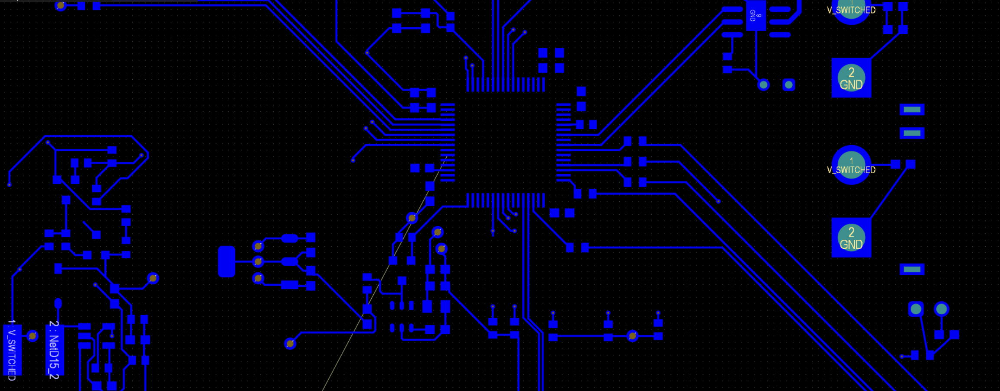
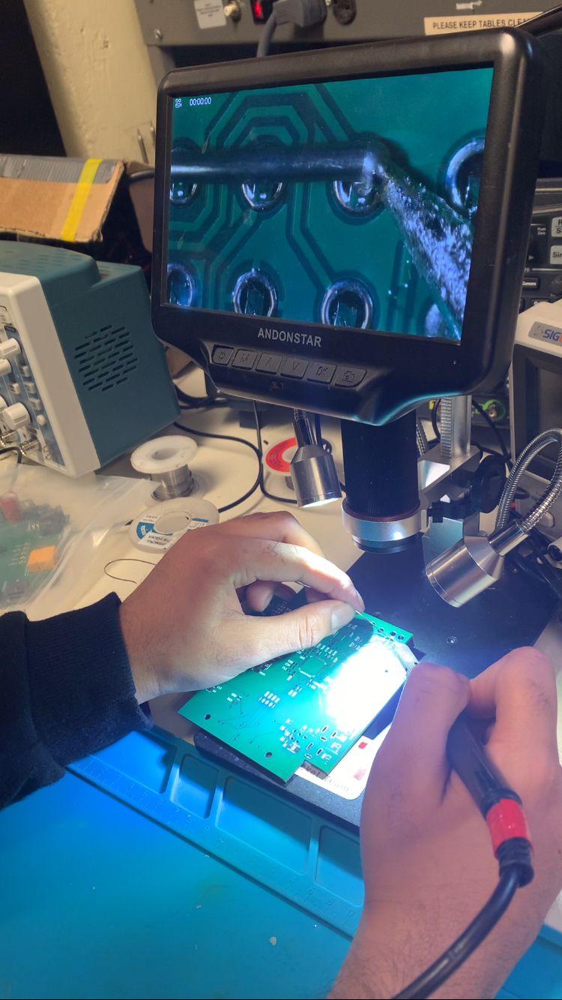

# 🪐 Dawoud Naseem 🪐

**`I have a secret 🤫 --> (I can control Electricty ⚡️💡)`**

👋 Hey there! I’m Dawoud — an Electrical Engineering student at McGill University passionate about building impactful hardware and software systems. I’m currently part of the McGill Rocket Team's Payload Hardware division, where I work on projects like bone acceleration sensing and thermoelectric cooling for space payloads. Always learning, always building 🚀

---

### 🧰 Languages and Tools

 

#

### 🌄 Cool Photos

  
  

#

<picture>
  <source media="(prefers-color-scheme: dark)" srcset="https://raw.githubusercontent.com/dawoudnaseem/dawoudnaseem/output/github-snake-dark.svg" />
  <source media="(prefers-color-scheme: light)" srcset="https://raw.githubusercontent.com/dawoudnaseem/dawoudnaseem/output/github-snake.svg" />
  
</picture>

<!--
**dawoudnaseem/dawoudnaseem** is a ✨ _special_ ✨ repository because its `README.md` (this file) appears on your GitHub profile.

Here are some ideas to get you started with everything:

- 🔭 I’m currently working on ...
- 🌱 I’m currently learning ...
- 👯 I’m looking to collaborate on ...
- 🤔 I’m looking for help with ...
- 💬 Ask me about ...
- 📫 How to reach me: ...
- 😄 Pronouns: ...
- ⚡ Fun fact: ...
-->
